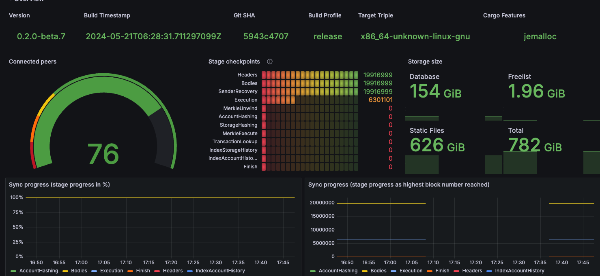
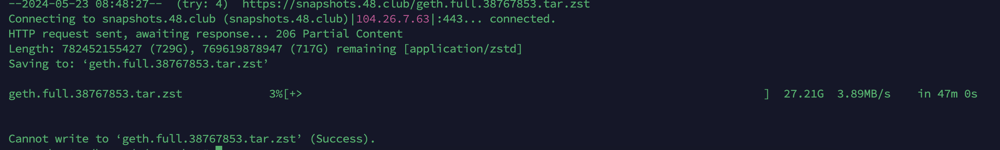
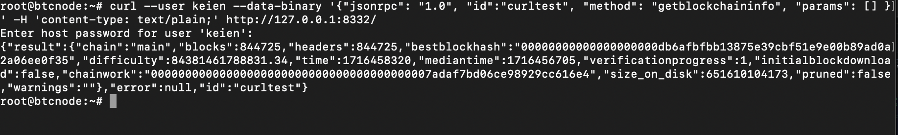
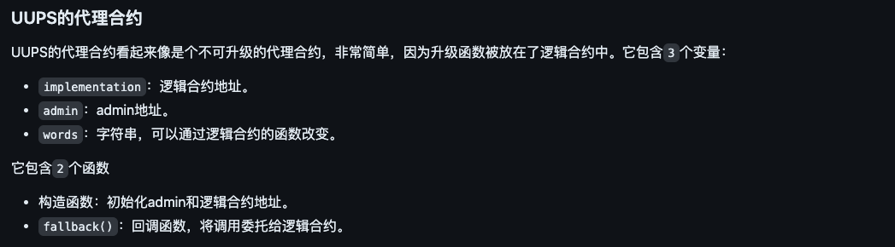

  
  <!-- dynamic typing effect 动态打字效果 -->
  

    
  

  <!-- knock code pictures 敲代码的图片 -->
  <picture>
    <source media="(prefers-color-scheme: dark)" srcset="https://cdn.jsdelivr.net/gh/sun0225SUN/sun0225SUN/assets/images/coding.gif" />
    <source media="(prefers-color-scheme: light)" srcset="https://cdn.jsdelivr.net/gh/sun0225SUN/sun0225SUN/assets/images/developer.svg" height="225px" />
    
  </picture>

  <!-- for beauty 留个空行好看点 -->
  
&nbsp;

  
  <!-- profile logo 个人资料徽标 -->
  

    &emsp;
    &emsp;
  

  
  <!-- Snake Code Contribution Map 贪吃蛇代码贡献图 -->
  <picture>
    <source media="(prefers-color-scheme: dark)" srcset="https://cdn.jsdelivr.net/gh/sun0225SUN/sun0225SUN/profile-snake-contrib/github-contribution-grid-snake-dark.svg" />
    <source media="(prefers-color-scheme: light)" srcset="https://cdn.jsdelivr.net/gh/sun0225SUN/sun0225SUN/profile-snake-contrib/github-contribution-grid-snake.svg" />
    
  </picture>

#  🙋 Hello

<table>
  
<tr><td>

### 🤺 About Me

&emsp;&emsp;嗨，你好，我是 keien。

&emsp;&emsp;热爱编程、唱，跳，rap，篮球。

&emsp;&emsp;热爱计算机科学和IT互联网事业，希望能成为一名优秀的开发者。

&emsp;&emsp;很喜欢的一句话是：这个时代唯一不变的就是变。无论何时，我们都应保持自我更新的能力，即便不能走到时代的最前列，也不能任由自己被时代抛弃，人只有不断更新自己，才能与时代的不确定性共舞。

&emsp;&emsp;所以我从最开始的公链开发一直在尝试着接触新的事物，碰巧的是在近几年的工作中学习到了很多，evm合约，sol合约，后端，慢慢的都有涉及，也都做出了几个不错的项目，但现在会时常思考，我的未来该是什么样子，我该如何去融入新时代的发展，我未来的路该如何规划呢？

<strong>&emsp;&emsp;We're making the world a better place. Through constructing elegant hierarchies for maximum code reuse and extensibility.</strong>

<!-- END_SECTION:brain -->

</td></tr>

<tr><td>

### 🤾‍♂️ Funny Soul

<!-- START_SECTION:douban -->
* <a href='https://book.douban.com/subject/35193035/' target='_blank'>读过认知觉醒</a> 🌟🌟🌟🌟🌟 力荐- 2024-1-10
* <a href='https://book.douban.com/subject/27040433/' target='_blank'>最近在读极简主义</a> 🌟🌟🌟🌟🌟 力荐- 2023-11-11
* <a href='http://movie.douban.com/subject/1292052/' target='_blank'>看过肖申克的救赎</a> 🌟🌟🌟🌟🌟 力荐- 2023-02-08
* <a href='http://movie.douban.com/subject/1292365/' target='_blank'>看过活着</a> 🌟🌟🌟🌟 力荐- 2023-02-07
* <a href='https://music.douban.com/subject/26567580/' target='_blank'>听过假如爱有天意</a> 🌟🌟🌟🌟🌟 力荐- 2023-02-02
<!-- END_SECTION:douban -->

<tr><td>
 <tr>
    <td>
      <h2>目前在做的</h2>
      
- 正在搭建 reth 节点，已同步至最新，空间占用才2t，速度很快，只不过必须要ssd才可以，机械硬盘根本追不上最新区块

      
    </td>
  </tr>
  <tr>
    <td>
      
- 正在下载 bsc节点快照，公司网络有问题，已反馈，并切换网络

      
    </td>
  </tr>
  <tr>
    <td>
      
- 正在跟上 btc 节点的最新区块，可配置user与password,rpc一直可用

      
    </td>
  </tr>
  <tr>
    <td>
      
- 巩固solidity基础知识

      
    </td>
  </tr>

</table>

